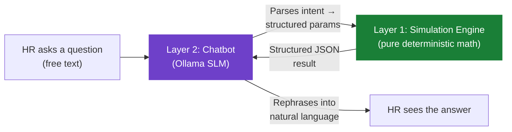

# Dayflow

> *Every workday, perfectly aligned.*

---

## Project Summary

Dayflow is a **Human Resource Management System (HRMS)** covering the standard HR lifecycle — authentication, employee profiles, attendance, leave, and payroll — redesigned around three principles the baseline design was missing:

| Problem | Solution |
|---|---|
| Payroll changes apply instantly, no warning to employees | Every change becomes a **Change Request** with a mandatory 30-day effective date; employee sees *Current vs Upcoming* values |
| Employee self-edits apply with no verification | Sensitive fields route through an **Admin-reviewed diff/approval** step before going live |
| Leave approval is slow, especially for emergencies | New **Emergency Leave** type is auto-approved on submission with retroactive review; SLA-based escalation for stalled standard requests |
| Onboarding & KT is slow | Role-based **onboarding checklists**, buddy assignment, and linked knowledge-base references per role |

---

## What Makes It Stand Out

### 🏆 Fair Gamification — Rewarding the Right Behavior

> **Design philosophy:** Most HR gamification systems inadvertently punish employees for taking legitimate time off by rewarding "zero absence" streaks. Dayflow explicitly corrects this.

| What's Rewarded | What's *Not* Penalized |
|---|---|
| Consistent on-time check-ins | Approved sick leave |
| Leave requested with advance notice | Emergency leave (auto-approved) |
| Peer-nominated helpfulness & mentorship | Total number of leaves taken |

**Key mechanics:**
- **Attendance streaks exclude approved Sick & Emergency Leave** — only unapproved/unplanned absence resets a streak, so employees are never pressured into unhealthy presenteeism.
- **Admin-weighted peer voting** for monthly/yearly titles (e.g., *"Most Helpful," "Onboarding Buddy of the Month"*) — 1 Admin vote = 3 peer votes (configurable cap) to reduce popularity bias.
- **Opt-in leaderboard** — employees choose whether their reliability stats are visible to peers, respecting individual privacy preferences.

### 🤖 What-If Workforce Simulator + Local AI Chatbot

HR can ask natural-language questions and receive **computed, auditable answers** — not AI-generated guesses:

> *"What happens if 20% of the engineering team takes leave next week?"*
>
> → Computes: workforce availability, workload redistribution, department capacity, attendance impact, and bottleneck identification.

> *"What if we give 3 extra paid leave days to all employees?"*
>
> → Computes: annual liability delta, per-department cost impact, policy comparison.

#### Two-Layer Trust Architecture

The feature is **deliberately split** so that every number shown to HR is deterministic and traceable, while natural language is used only where it adds convenience:



| Layer | What It Does | Trust Level |
|---|---|---|
| **Simulation Engine** | Runs deterministic calculations over real HRMS data (headcount, leave records, attendance history). Produces capacity percentages, cost deltas, redistribution estimates. | ✅ **Source of truth** — every number originates here |
| **Chatbot (NLP)** | Parses free-text questions into structured parameters. Rephrases the engine's JSON output into a human-readable answer. Runs locally via Ollama. | ⚠️ **Convenience layer** — never generates or invents numbers |

**Why this matters:** In an HR tool, a hallucinated headcount or salary figure would be a serious trust failure. By ensuring the language model *never produces numbers itself*, every prediction is fully auditable back to the underlying query.

**Privacy guarantee:** No employee data leaves local infrastructure. The model runs entirely on-premises via **Ollama** (e.g., Llama 3.2 3B or Phi-3 Mini) — zero third-party LLM API calls.

---

## Architecture

**Backend:** FastAPI, built as a **modular monolith** — one deployable application with strict module boundaries, each owning its own database tables and exposing a small service-function interface to the others.

```
backend/
├── app/
│   ├── main.py
│   ├── core/
│   │   ├── config.py          # Pydantic Settings, env vars
│   │   ├── database.py        # SQLAlchemy engine, SessionLocal, Base
│   │   ├── security.py        # JWT auth, get_current_user dependency
│   │   └── scheduler.py       # APScheduler for daily jobs
│   │
│   ├── shared/
│   │   └── change_request/    # Approval/diff pattern (reused by Payroll + Employee)
│   │       ├── models.py
│   │       ├── schemas.py
│   │       └── service.py
│   │
│   └── modules/
│       ├── auth/              # Sign up, sign in, JWT tokens
│       ├── employee/          # Profile CRUD, verified-edit workflow
│       ├── attendance/        # Check-in/out, daily/weekly views
│       ├── leave/             # Time-off requests, emergency leave fast-track
│       ├── payroll/           # Salary components, 30-day change requests
│       ├── onboarding/        # Checklists, buddy assignment
│       ├── gamification/      # Points, badges, leaderboard
│       ├── simulation/        # What-if engine (pure deterministic math)
│       ├── chatbot/           # Ollama-powered NLP front-end
│       └── notification/      # In-app + email notifications
│
├── alembic/                   # Database migrations
├── tests/
├── docker-compose.yml
├── requirements.txt
└── .env
```

### Module Responsibilities

| Module | Owner | Description |
|---|---|---|
| `auth` | Dev A / DevOps | JWT sign-up/sign-in, role-based access control |
| `employee` | Dev A | Profile CRUD, self-serve vs verified-edit field tiers |
| `attendance` | Dev A | Check-in/out tracking, daily/weekly views, streak calculation |
| `leave` | Dev A | PTO/Sick/Unpaid/Emergency leave, SLA escalation |
| `payroll` | Dev A | Salary components, 30-day advance-notice change workflow |
| `onboarding` | Dev A | Role-based checklists, buddy/mentor assignment |
| `gamification` | Dev B | Points economy, badges, opt-in leaderboard |
| `simulation` | Dev B | Deterministic what-if engine (salary, headcount, leave policy) |
| `chatbot` | Dev B | Ollama streaming client, context builder across all modules |
| `notification` | Dev B | In-app + email notifications, shared contract for all modules |
| `shared/change_request` | Dev A | Approval/diff pattern reused by payroll + employee edits |
| `core/*` | DevOps | Config, database, security, scheduler |

---

## User Roles

| Role | Capabilities |
|---|---|
| **Admin / HR Officer** | Manage employees, verify edits, approve leave & payroll changes, view analytics, run workforce simulations |
| **Employee** | View/edit own profile (verified for sensitive fields), track attendance, apply for leave, view salary (read-only), participate in gamification |

---

## Core Modules — Detailed Design

### 5.1 Authentication & Authorization

- **Sign Up:** Admin-only account creation. Login ID auto-generated: `CC + First 2 letters of first & last name + Year + Serial`. Example: `0C210C202A0001`
- **Sign In:** Login ID/Email + Password. Non-revealing error messages. JWT-based sessions.
- First login forces password change.

### 5.2 Dashboard

- **Employee Dashboard:** Clickable employee cards with status indicators (🟢 Present, 🟠 On Leave, 🟡 Absent). Check-In/Check-Out systray control.
- **Admin Dashboard:** Full employee list, attendance records, pending approvals queue.

### 5.3 Employee Profile Management

- **Tabs:** Personal Info, Private Info, Salary Info (Admin-only), Security
- **Self-serve fields** (instant): profile picture, bio, hobbies, skills
- **Verified fields** (Change Request → Admin approval): address, phone, bank details, emergency contact
- Admin edits are authoritative (no approval step).

### 5.4 Attendance Management

- Daily/weekly views with Check-In, Check-Out, Work Hours, Extra Hours columns.
- Status types: Present, Absent, Half-day, Leave.
- Field-based employees: attendance inferred from task completion.
- Attendance data drives payroll: unpaid leave / missing attendance reduces payable days.

### 5.5 Leave & Time-Off Management

- **Types:** Paid Time Off, Sick Leave, Unpaid Leave, Emergency Leave
- Calendar view with remaining balances and applied time-off.
- Status flow: Pending → Approved / Rejected
- Emergency leave: auto-provisionally-approved (see Section 7.3).

### 5.6 Payroll / Salary Management

- **Employee view:** Read-only. Monthly/Yearly Wage, Components (Basic, HRA, Standard Allowance, Performance Bonus, LTA, Fixed Allowance), PF, Tax.
- **Admin control:** Define wage type (Fixed / % of wage), configure components, set working days/base hours.
- Auto-calculation: components computed from wage (e.g., Basic = 60% of ₹50,000 = ₹30,000; HRA = 50% of Basic = ₹15,000). Total components enforced ≤ defined wage.
- All changes subject to 30-day advance notice (Section 7.1).

---

## Problem Solutions

### 7.1 Payroll Change — 30-Day Advance Notice

Every payroll edit creates a `pending_change` record with `effective_date = today + 30 days` and a required reason.

- Employee notified immediately via Notification module.
- Salary Info shows **Current** and **Upcoming (effective DD/MM/YYYY)** side by side.
- Optional employee acknowledgment (receipt, not approval).
- **Immediate Correction override:** for genuine data-entry mistakes, logged and flagged separately.
- Daily scheduled job applies changes whose `effective_date` has arrived.

### 7.2 Employee Edit Verification

Sensitive field edits create a Change Request with old value, new value → routed to Admin.

- Admin sees a **diff view** (old vs proposed), can Approve or Reject (with required comment).
- Until approved, official record retains old value — downstream processes never disrupted by unverified data.
- Uses the **same Change Request module** as payroll changes.

### 7.3 Emergency Leave Fast Track

- Emergency leave is **auto-provisionally-approved** on submission.
- Flagged "Provisional" and visible to Admin immediately.
- Admin can retroactively flag/reject within a review window (e.g., 48 hours).
- **Abuse prevention:** configurable cap on provisional emergency leaves before requiring real-time approval.
- **SLA escalation:** for planned leave, if a request sits Pending beyond a threshold (24–48 hrs), the system auto-notifies a secondary approver.

### 7.4 Onboarding & Knowledge Transfer

- Role-based onboarding checklist templates auto-assigned on employee creation.
- Progress bar visible to new hire and Admin.
- Buddy/Mentor field on employee record.
- Role/department links to knowledge-base doc repository.

---

## Novel Feature: Gamification & Recognition

### What Is Rewarded

- **Reliability:** consistent on-time check-ins, low unplanned absence (not total leave).
- **Planning discipline:** leave requested with good advance notice.
- **Peer recognition:** monthly/yearly titles via organization-wide voting.
- Streaks **exclude approved Sick/Emergency Leave** — only unapproved absence resets them.

### Mechanics

- Badges and trophies displayed on dashboard cards and profiles.
- **Admin-weighted voting:** 1 Admin vote = 3 peer votes (configurable cap).
- Leaderboard is **opt-in** per employee.

---

## Novel Feature: What-If Workforce Simulator & HR Chatbot

### Example Questions

- *"What happens if 20% of the engineering team takes leave next week?"* → computes workforce availability, workload redistribution, department capacity, bottlenecks.
- *"What if 5 employees resign?"* → estimates operational impact on affected departments.

### Two-Layer Architecture

| Layer | Role | Trust Level |
|---|---|---|
| **Simulation Engine** | Deterministic math over real HRMS data (headcount, leave records, attendance history). Produces capacity %, redistribution estimates, bottleneck flags. | ✅ Source of truth — all numbers come from here |
| **Chatbot (NLP)** | Parses free-text → structured params. Rephrases engine output → natural language. Runs locally via Ollama. | ⚠️ Convenience layer only — never invents numbers |

### Local-Model Constraint

- No third-party LLM API calls (Gemini, OpenAI, etc.).
- Runs entirely on local infrastructure via **Ollama**.
- Small quantized model (e.g., Llama 3.2 3B or Phi-3 Mini).
- Intent-parsing uses structured JSON output from Ollama (`format: "json"`).

---

## Non-Functional Requirements

| Requirement | Implementation |
|---|---|
| **Security** | Role-based access at every module boundary; JWT sessions; elevated permissions for sensitive fields |
| **Transparency** | Every change logged: old value, new value, requester, approver, timestamp |
| **Auditability** | Simulation results traceable to underlying data queries, never opaque model output |
| **Privacy** | No employee data leaves local infrastructure; Ollama runs on-premises |
| **Usability** | Dashboard cards, calendar views, diff-based approval screens — minimize clicks for frequent actions |
| **Extensibility** | Module boundaries designed for future extraction into standalone services |

---

## Tech Stack

| Layer | Technology |
|---|---|
| Backend Framework | FastAPI |
| ORM | SQLAlchemy 2.0+ |
| Migrations | Alembic |
| Validation | Pydantic 2.0+ |
| Auth | python-jose (JWT), passlib (bcrypt) |
| Scheduler | APScheduler |
| HTTP Client | httpx |
| AI / NLP | Ollama (local SLM) |
| Database | PostgreSQL |
| Testing | pytest, pytest-asyncio, pytest-mock |
| Containerization | Docker, docker-compose |

---

## Design References

- [Wireframes & Flow Diagrams (Excalidraw)](https://link.excalidraw.com/l/65VNwvy7c4X/58RLEJ4oOwh)